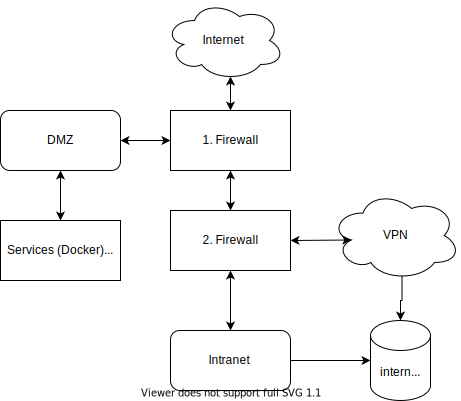

# Simple-School-Tool

This project is in the beginning and is not useable at the momtent.
This project is designed to help schools develop their IT infrastructure.

## requirements
- public ip
- domainname for public dns
- server: for the running docker container
- docker + docker-compose: for the simple-school-tool

## first start
1. Load the project
```
git clone https://github.com/simpleman95/simple-school-tool.git
cd simple-school-tool
```
2. configurate the project

3. build and start the docker containers
```
docker-compose build
docker-compose up
``` 


## simple-school-tool architecture


## School infrastructure
This is a example for a possible school infrastructure

